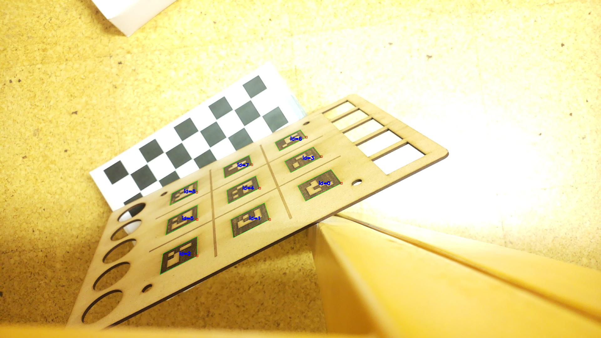

# 🤖 Tic-Tac-Toe-Showdown-Humans-vs.-Robot

This project implements a **Tic Tac Toe game on a physical board**, controlled via a **robotic arm** and a Python-based interface. The system uses ROS2, OpenCV, and custom control logic to detect the game state and make decisions using AI.

---

## 📁 Project Structure

```
.
├── Defaults/            # JSON files acting as a database (config, positions, colors, etc.)
│   ├── deteacaocor.json
│   ├── jogo.json
│   ├── posicoes.json
│   └── SetupDetecao.json

├── Externo/             # Main interaction logic with the robot & game interface
│   ├── arukos.png       # Debug Resource
│   ├── getPosicaoRos.py # Used for position setup on the interface
│   ├── gradie.py        # Main GUI and controller interface
│   ├── move.py          # Movement utilities with Gripper
│   ├── movePosicaoRos.py# Movement without gripper initialization (Used on the GUI)
│   ├── robotMove.py     # Movement tester, confirm if the robotic arm is moving or not( We had issues with the controller which not always would respond to the commaands)
│   └── temp.py          # Example of how to make custom movement (Used for demonstrarion while the rest was being mounted)

├── libs/                # Support libraries
│   ├── ImageRec.py      # Image recognition for detecting moves
│   ├── JsonLib.py       # JSON read/write helpers
│   ├── NegaMax.py       # Game AI using NegaMax algorithm
│   ├── RasConnect.py    # Raspberry Pi communication
│   ├── YoloDataset.py   # Yolo with custom dataset
│   └── YoloPool.py      # Yolo with dataset pretrained from a pool

├── instructions.txt     # Setup & run steps (original notes)
└── main.py              # Game control logic
└── vars.py              # Just a static variable file, used mainly for game logic and AI
```

---

## 🚀 Installation & Setup

### Prerequisites

- [ROS2 Humble](https://docs.ros.org/en/humble/index.html)
- Python 3.8+
- UR robotic arm 
- Camera (for board detection)
- Poetry (Python dependency manager)

### Install Poetry

```bash
pip install poetry
```

### Install Dependencies

```bash
poetry install
```

### Start the App

```bash
poetry run start
```

---

## 🧠 Running the Full System

### Terminal 1 – Launch UR Simulator

```bash
ros2 run ur_client_library start_ursim.sh -m ur3e
```

### Terminal 2 – Start UR Robot Driver

```bash
ros2 launch ur_robot_driver ur_control.launch.py \
  ur_type:=ur3e \
  use_fake_hardware:=false \
  robot_ip:=192.168.1.102 \
  launch_rviz:=false
```

### Terminal 3 – Start the Control Interface

```bash
cd ~/Desktop/revised/

source venv/bin/activate
python3 -m Externo.gradie
sudo chmod a+rw /dev/ttyACM0
```

---

## 🎮 Features

- Real-time move detection using camera and computer vision
- Autonomous opponent with **NegaMax AI**
- Robotic arm movement using ROS2
- Customizable board settings via JSON
- YOLO integration for visual detection (optional)

---

## 📝 Notes

- The `gradie.py` file in `Externo/` is your main control interface.
- JSON files in `Defaults/` act like a lightweight configuration "database".
- Make sure your serial port (`/dev/ttyACM0`) has appropriate permissions. Currently the initialization of the gripper is commented out for testing purposes.
- YOLO-related scripts are modular and optional depending on your image detection setup.

---

## 📷 Screenshot

> 
> [Youtube Demonstration video](https://youtu.be/1h4A4BJpWyk)

---

## 📄 License

GNU Affero General Public License v3.0 
